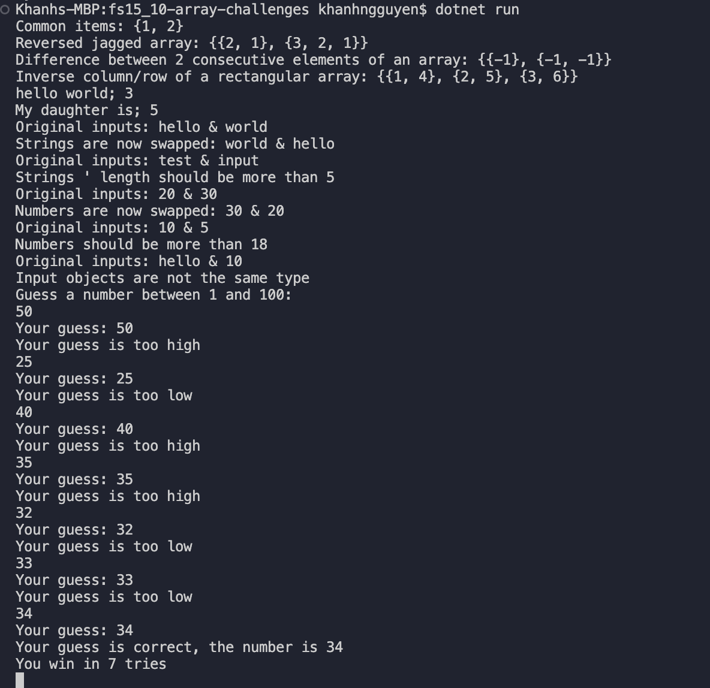
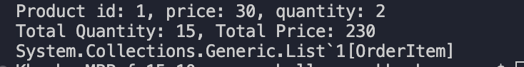

# Array challenges

Check requirements for each challenge in `Program.cs`

## Test your output

Run `dotnet run` or `dotnet watch` to execute your codes

## Result
Results for challenges 1 - 7

Result for challenge 8

